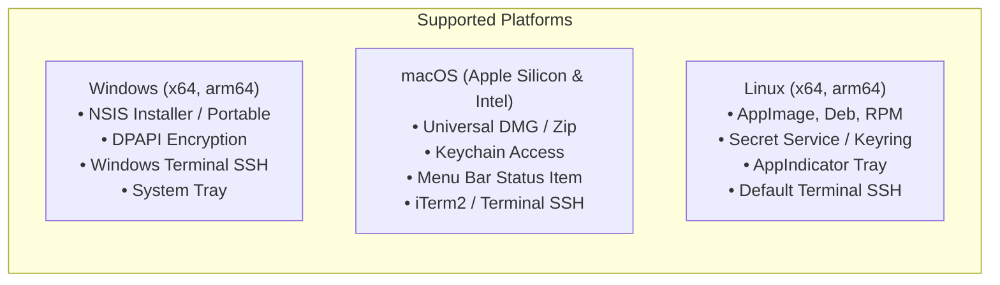
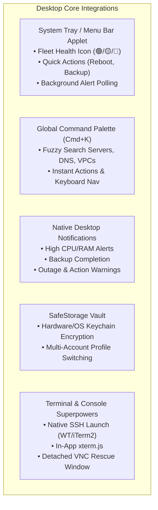

# BLDesk (BinaryLane Desktop) - Comprehensive Requirements & Technical Specification

> **Specification Source**: Fully aligned with BinaryLane OpenAPI v3.0.4 (`https://api.binarylane.com.au/reference/`) and BinaryLane mPanel Web Architecture.

---

## 1. Executive Overview

**BLDesk** is a modern, high-performance, cross-platform (Windows, macOS, Linux) desktop management application for the **BinaryLane** cloud platform. 

It provides **100% complete feature parity** with the BinaryLane mPanel Web Console and REST API v2, enriched with desktop-exclusive capabilities:
* **Background fleet health monitoring & System Tray / Menu Bar widget**
* **Instant Command Palette (`Ctrl+K` / `Cmd+K`)**
* **Native SSH & Embedded `xterm.js` Terminal**
* **Detachable Out-of-Band Rescue Web Console (VNC / Serial)**
* **Local Caching & Offline-first Search**
* **Secure Token Vault via Hardware/OS Encryption (`safeStorage`)**
* **Multi-Account / Profile Switching**

---

## 2. Platform & OS Support Matrix



---

## 3. End-to-End API Coverage & Domain Specifications

Based on the 94 endpoints, 206 schemas, and 42 server actions in the BinaryLane OpenAPI 3.0.4 spec:

### 3.1 Authentication, Security & Multi-Profile Vault
* **Authentication Options**:
  * **OAuth 2.0 (PKCE)**: Local loopback server (`http://127.0.0.1:<port>/callback`) and custom protocol scheme (`bldesk://oauth/callback`).
  * **Personal Access Token (PAT)**: Direct input with immediate validation via `GET /v2/account`.
* **Credential Encryption**:
  * Token storage secured at rest via Electron `safeStorage` (Windows DPAPI, macOS Keychain, Linux Secret Service).
* **Multi-Account Profiles**:
  * Switch seamlessly between multiple BinaryLane accounts (Personal, Production, Client Accounts) without re-authenticating.
* **Account Info**:
  * `GET /v2/account`: Current account status, email, email verification status, warnings, and limits.
  * `GET /v2/customers/my/balance`: Live credit balance, pending invoices, debit balance, currency, and projected monthly billing.

---

### 3.2 Compute Fleet & Server Lifecycle Management

#### Server Inventory & Detail View
* `GET /v2/servers`: Fleet overview with tag filtering, search, status pills (🟢 Running, 🟡 Booting/Action in Progress, 🔴 Stopped, ⚪ Suspended).
* `POST /v2/servers`: Server creation wizard with region selection, size/plan, distribution OS / application image, SSH key selection, VPC assignment, user-data cloud-init scripts, backup schedule selection, and password setup.
* `GET /v2/servers/{server_id}`: Comprehensive server metadata (RAM, vCPU, storage, primary IPv4/IPv6, private networking IPs, status, attached firewalls, region).
* `DELETE /v2/servers/{server_id}`: Server cancellation with confirmation safeguards.
* `POST /v2/servers/{server_id}/actions#Uncancel`: Revert scheduled cancellation.
* `POST /v2/servers/{server_id}/actions#Rename`: Instant hostname / server label update.

#### 42 Server Actions Matrix
| Category | Action | API Endpoint & Payload |
| :--- | :--- | :--- |
| **Power Controls** | Power On | `POST /v2/servers/{id}/actions` (`type: power_on`) |
| | Power Off (Hard) | `POST /v2/servers/{id}/actions` (`type: power_off`) |
| | Power Cycle | `POST /v2/servers/{id}/actions` (`type: power_cycle`) |
| | Graceful Shutdown | `POST /v2/servers/{id}/actions` (`type: shutdown`) |
| | Reboot | `POST /v2/servers/{id}/actions` (`type: reboot`) |
| | Reset Password | `POST /v2/servers/{id}/actions` (`type: password_reset`, `password?`) |
| **Diagnostics** | Ping Test | `POST /v2/servers/{id}/actions` (`type: ping`) |
| | Check Running State | `POST /v2/servers/{id}/actions` (`type: is_running`) |
| | Uptime Check | `POST /v2/servers/{id}/actions` (`type: uptime`) |
| **Hardware & Disks** | Resize Server | `POST /v2/servers/{id}/actions` (`type: resize`, `size`, `options?`) |
| | Add Disk | `POST /v2/servers/{id}/actions` (`type: add_disk`, `size_gigabytes`) |
| | Resize Disk | `POST /v2/servers/{id}/actions` (`type: resize_disk`, `disk_id`, `size_gigabytes`) |
| | Delete Disk | `POST /v2/servers/{id}/actions` (`type: delete_disk`, `disk_id`) |
| **OS & Images** | Rebuild Server | `POST /v2/servers/{id}/actions` (`type: rebuild`, `image`, `ssh_keys?`) |
| | Change Kernel | `POST /v2/servers/{id}/actions` (`type: change_kernel`, `kernel_id`) |
| | Disable SELinux | `POST /v2/servers/{id}/actions` (`type: disable_selinux`) |
| **Networking** | Change Network (VPC) | `POST /v2/servers/{id}/actions` (`type: change_network`, `vpc_id`) |
| | Change VPC IPv4 | `POST /v2/servers/{id}/actions` (`type: change_vpc_ipv4`, `current_ipv4`, `new_ipv4`) |
| | Separate Private NIC | `POST /v2/servers/{id}/actions` (`type: change_separate_private_network_interface`, `enabled`) |
| | Source/Dest Check | `POST /v2/servers/{id}/actions` (`type: change_source_and_destination_check`, `enabled`) |
| | Toggle IPv6 | `POST /v2/servers/{id}/actions` (`type: change_ipv6`, `enabled`) |
| | Enable IPv6 | `POST /v2/servers/{id}/actions` (`type: enable_ipv6`) |
| | Port Blocking (SMTP/25) | `POST /v2/servers/{id}/actions` (`type: change_port_blocking`, `enabled`) |
| | IPv4 Reverse DNS (PTR) | `POST /v2/servers/{id}/actions` (`type: change_reverse_name`, `ipv4_address`, `reverse_name`) |
| | IPv6 Reverse Nameservers | `POST /v2/servers/{id}/actions` (`type: change_ipv6_reverse_nameservers`, `ipv6_reverse_nameservers`) |
| **Backups & Recovery**| Take Backup | `POST /v2/servers/{id}/actions` (`type: take_backup`, `replacement_strategy?`) |
| | Restore Backup | `POST /v2/servers/{id}/actions` (`type: restore`, `image_id`) |
| | Clone Using Backup | `POST /v2/servers/{id}/actions` (`type: clone_using_backup`, `image_id`, `target_server_id`) |
| | Attach Backup Disk | `POST /v2/servers/{id}/actions` (`type: attach_backup`, `image_id`) |
| | Detach Backup Disk | `POST /v2/servers/{id}/actions` (`type: detach_backup`) |
| | Enable Backups | `POST /v2/servers/{id}/actions` (`type: enable_backups`) |
| | Disable Backups | `POST /v2/servers/{id}/actions` (`type: disable_backups`) |
| | Backup Schedule | `POST /v2/servers/{id}/actions` (`type: change_backup_schedule`, `backup_hour?`, `schedule?`) |
| | Offsite Backup Location | `POST /v2/servers/{id}/actions` (`type: change_offsite_backup_location`, `offsite_location`) |
| | Offsite Backup Copies | `POST /v2/servers/{id}/actions` (`type: change_manage_offsite_backup_copies`, `enabled`) |
| **Advanced & Cluster**| Advanced Features | `POST /v2/servers/{id}/actions` (`type: change_advanced_features`, `features`) |
| | Advanced Firewall Rules | `POST /v2/servers/{id}/actions` (`type: change_advanced_firewall_rules`, `firewall_rules`) |
| | Partner Server (HA Pair) | `POST /v2/servers/{id}/actions` (`type: change_partner`, `partner_server_id?`) |
| | Region Migration | `POST /v2/servers/{id}/actions` (`type: change_region`, `region`) |
| | Threshold Alerts | `POST /v2/servers/{id}/actions` (`type: change_threshold_alerts`, `alerts`) |

---

### 3.3 Real-Time Performance, Metrics & Data Usage
* **SampleSets (Live & Historical Graphs)**:
  * `GET /v2/samplesets/{server_id}/latest`: Instant CPU, RAM, Disk I/O, Network gauge display.
  * `GET /v2/samplesets/{server_id}`: Time-series historical metrics.
  * **Supported Metrics**:
    * `cpu_usage_percent` & `cpu_usage_detailed` (per-vCPU breakdown)
    * `memory_usage_bytes` & `maximum_memory_megabytes`
    * `storage_usage_megabytes` & `maximum_storage_gigabytes`
    * `storage_read_kbps`, `storage_write_kbps`, `storage_read_requests_per_second` (Read IOPS), `storage_write_requests_per_second` (Write IOPS)
    * `network_incoming_kbps` & `network_outgoing_kbps`
* **Data Transfer & Pooled Bandwidth**:
  * `GET /v2/data_usages/{server_id}/current`: Individual server transfer quota vs consumed GB.
  * `GET /v2/data_usages/current`: Account-wide pooled data transfer dashboard.
* **Threshold Alerts Dashboard**:
  * `GET /v2/servers/threshold_alerts`: Fleet-wide overview of active threshold breaches.
  * `GET /v2/servers/{server_id}/threshold_alerts`: Detailed server alert rules (CPU, memory, disk, network bandwidth alerts).

---

### 3.4 Terminal, Native SSH & Out-of-Band Rescue Console
* **Direct Native SSH Launcher**:
  * Auto-detect and launch installed terminal emulators:
    * Windows: **Windows Terminal**, **PowerShell**, **Command Prompt**, **PuTTY**
    * macOS: **Terminal.app**, **iTerm2**, **Alacritty**, **Kitty**
    * Linux: **Default x-terminal-emulator**, **GNOME Terminal**, **Konsole**, **Alacritty**
  * Spawns with pre-filled SSH connection string (`ssh root@<server_ip> -i <key_path>`).
* **Embedded `xterm.js` Terminal**:
  * Integrated terminal panel directly inside BLDesk for quick inline SSH access.
* **Out-of-Band Rescue Web Console (VNC / Serial)**:
  * `GET /v2/servers/{server_id}/console`: Fetches temporary authenticated `iframe` and `browser` console URLs.
  * Embedded or standalone detachable window with auto-reconnect and resolution scaling (`width` × `height`).

---

### 3.5 Networking, VPCs, Firewall & Reverse DNS
* **VPC Management**:
  * `GET /v2/vpcs`: List all VPC networks.
  * `POST /v2/vpcs`: Create new VPC with custom name and IP range (e.g. `10.240.0.0/16`).
  * `GET /v2/vpcs/{vpc_id}` / `PUT /v2/vpcs/{vpc_id}` / `DELETE /v2/vpcs/{vpc_id}`: Manage VPC name and configuration.
  * `GET /v2/vpcs/{vpc_id}/members`: List all member servers with their assigned VPC IPs.
* **Advanced Firewall Rules Visual Editor**:
  * `GET /v2/servers/{server_id}/advanced_firewall_rules`: Visual inbound/outbound rule matrix.
  * Rule builder with action (`drop`/`accept`), protocol (`tcp`/`udp`/`icmp`/`all`), port ranges, source CIDR, and description.
* **Reverse DNS (rDNS & IPv6)**:
  * `GET /v2/reverse_names/ipv6` & `POST /v2/reverse_names/ipv6`: Manage global IPv6 reverse nameservers.
  * IPv4 PTR record manager for all public IPs.

---

### 3.6 Load Balancers
* `GET /v2/load_balancers`: List all active load balancers.
* `POST /v2/load_balancers`: Provision new Load Balancer (region, name, forwarding rules, health checks).
* `GET /v2/load_balancers/{id}` / `PUT /v2/load_balancers/{id}` / `DELETE /v2/load_balancers/{id}`.
* `GET /v2/load_balancers/availability`: Live load balancer availability and pricing.
* **Server Membership**:
  * `POST /v2/load_balancers/{id}/servers` & `DELETE /v2/load_balancers/{id}/servers`: Attach/detach backend target servers.
* **Forwarding Rules & SSL**:
  * `POST /v2/load_balancers/{id}/forwarding_rules` & `DELETE /v2/load_balancers/{id}/forwarding_rules`: Add/remove HTTP, HTTPS, TCP, UDP rules with SSL certificate bindings.
* **Health Checks**:
  * Configure HTTP/TCP health checks, path, interval, timeout, unhealthy threshold, healthy threshold.

---

### 3.7 DNS Management (Domains & Records)
* **Domain Zones**:
  * `GET /v2/domains`: List all hosted DNS zones.
  * `POST /v2/domains`: Add new domain zone with auto-fill standard record templates.
  * `GET /v2/domains/{domain_name}` & `DELETE /v2/domains/{domain_name}`.
  * `GET /v2/domains/nameservers`: Public BinaryLane authoritative nameservers.
  * `POST /v2/domains/refresh_nameserver_cache`: Immediate flush of nameserver cached records.
* **DNS Record CRUD**:
  * `GET /v2/domains/{domain_name}/records`: Interactive DNS table with record type badges.
  * `POST /v2/domains/{domain_name}/records`: Add record (`A`, `AAAA`, `CNAME`, `MX`, `TXT`, `SRV`, `NS`, `CAA`).
  * `PUT /v2/domains/{domain_name}/records/{id}`: In-line record editor.
  * `DELETE /v2/domains/{domain_name}/records/{id}`: Delete with confirmation.
  * **Quick DNS Health Check**: In-app dig/DNS propagation verification.

---

### 3.8 Backups, Images & Storage
* **Backups**:
  * `GET /v2/servers/{server_id}/backups`: List automatic daily/weekly backups with retention status.
  * `POST /v2/servers/{server_id}/backups`: Upload external backup image.
* **Image Registry & Disks**:
  * `GET /v2/images`: Browse base OS distributions, pre-configured application stacks, and custom images.
  * `GET /v2/images/{image_id}/download`: Generate direct disk image download links (`qcow2`/`raw`).

---

### 3.9 SSH Keys Management
* `GET /v2/account/keys`: List stored public SSH keys.
* `POST /v2/account/keys`: Add new SSH key (with paste from clipboard or import local `~/.ssh/id_ed25519.pub`).
* `PUT /v2/account/keys/{key_id}` & `DELETE /v2/account/keys/{key_id}`.

---

### 3.10 Invoices, Billing & Customers
* `GET /v2/customers/my/invoices`: View invoice history with status (Paid, Due, Failed), date, and totals.
* `GET /v2/customers/my/invoices/{invoice_id}`: Invoice breakdown and direct PDF download link.
* `GET /v2/customers/my/unpaid-payment-failed-invoices`: Immediate badge notification for overdue/failed payments.

---

### 3.11 Async Actions & Background Task Tracking
* `GET /v2/actions`: Global asynchronous action stream across the account.
* `GET /v2/servers/{server_id}/actions`: Server-specific action logs.
* `POST /v2/actions/{action_id}/proceed`: Handle interactive actions (`UserInteractionRequired`).
* Live progress bar indicator in the status bar for ongoing provisioning, backups, and resizes.

---

## 4. Desktop-Exclusive Superpowers



---

## 5. Technology Stack

| Layer | Tool / Library | Role |
| :--- | :--- | :--- |
| **Desktop Shell** | Electron 35+ / TypeScript | Cross-platform desktop runtime |
| **Build Tool** | `electron-vite` | Fast HMR, Rollup bundling, multi-process config |
| **UI Framework** | React 19 + TypeScript | High performance reactive UI |
| **Styling & UI** | Tailwind CSS + `shadcn/ui` + Lucide Icons | Sleek modern cloud console layout |
| **API Client** | `openapi-typescript` + `openapi-fetch` | 100% typed client directly from OpenAPI 3.0.4 spec |
| **State & Caching**| TanStack Query v5 (React Query) | Background refetching, optimistic mutations, server status cache |
| **Terminal** | `xterm.js` + `xterm-addon-fit` | In-app serial/SSH terminal |
| **Data Visualization**| Recharts / Chart.js | Real-time CPU, RAM, Disk I/O & Network graphs |
| **Packaging** | `electron-builder` | Multi-target distribution (NSIS, DMG, AppImage, Deb, RPM) |
| **Auto Updates** | `electron-updater` | Automated background updates via GitHub Releases |

---

## 6. Implementation Phases & Roadmap

```
Phase 1: Foundation, Security & Typed API Layer
 ├── electron-vite + React + Tailwind + Lucide setup
 ├── SafeStorage IPC Bridge (DPAPI/Keychain/SecretService)
 ├── OpenAPI 3.0.4 TypeScript Generation (openapi-typescript)
 └── Auth Screen (OAuth loopback server + PAT input + Profile Switcher)

Phase 2: Fleet Dashboard & Compute Operations
 ├── Server Grid/List view with live filters and tags
 ├── Detailed Server Page (Specs, Network IPs, Software, Storage Disks)
 ├── Complete 42 Server Actions IPC & Mutation Handlers
 └── Real-time SampleSets Metrics Graphs (CPU, RAM, Disk IOPS, Network)

Phase 3: Terminal, SSH & Rescue Console
 ├── Native Terminal Launcher (Windows Terminal / iTerm2 / Linux)
 ├── In-app embedded xterm.js Terminal
 └── Detached VNC / Serial Rescue Console Window

Phase 4: Networking, Firewall, VPC & DNS
 ├── VPC Topology & Member Servers
 ├── Visual Inbound/Outbound Firewall Rules Builder
 ├── DNS Zone & Record CRUD Manager + Propagation Inspector
 ├── Load Balancer Manager (Forwarding rules, Health checks, Target servers)
 └── IPv4 PTR / IPv6 Reverse DNS Manager

Phase 5: Backups, Images, SSH Keys & Billing
 ├── Backups Manager (Schedule, Restore, Clone, Attach)
 ├── Public SSH Keys Vault (Import from ~/.ssh)
 ├── Image Registry & Disk Downloads
 └── Invoices, Credit Balance & Data Pooling Monitor

Phase 6: Desktop Productivity & Native OS Features
 ├── System Tray / Menu Bar Fleet Monitor & Quick Actions
 ├── Global Command Palette (Cmd+K / Ctrl+K)
 ├── Native OS Desktop Notifications
 └── Global Async Action Progress Stream

Phase 7: Packaging, Multi-OS CI/CD & Auto-Updates
 ├── Windows (NSIS, Portable), macOS (DMG, Universal), Linux (AppImage, Deb)
 └── GitHub Releases Auto-Update pipeline
```
